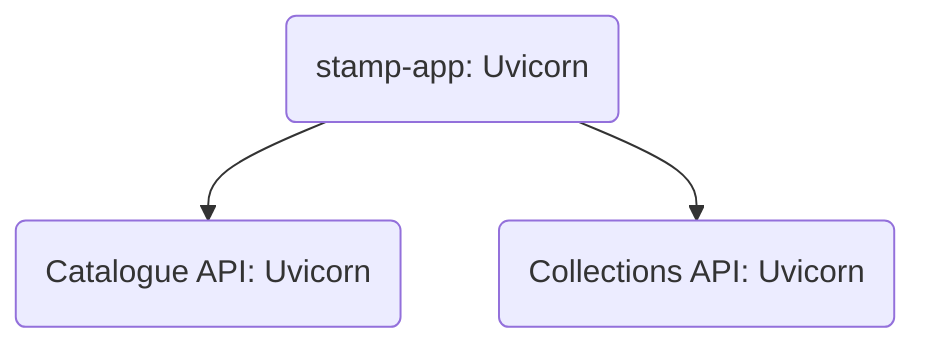

# Faststamps

Faststamps is a [responsive web-application](https://en.wikipedia.org/wiki/Responsive_web_design) for managing a stamp collection. This is a sandbox project for trying out [FastAPI](https://fastapi.tiangolo.com/) & [HTMX](https://htmx.org/) in a tiny micro-service based system, and also for trying out some new technology and ideas. If you happen to stumble over this repo, please note it is far from a "1.0 release" and I only work on it sporadically.

Since it is a responsive web-application, you can use it in your mobile phone to keep track of your stamp collection.

It consists of three components:

  * A web application **stamp-app** written in [HTMX](https://htmx.org/) and [Bulma](https://bulma.io/) served by [FastAPI](https://fastapi.tiangolo.com/) packaged as a Docker images.
  * A backend consisting of two micro-services packaged as Docker images:
    * A read-only HTTP/JSON API **stamp-catalogue-api** implemented with [FastAPI](https://fastapi.tiangolo.com/) and containing a stamp catalogue, using a CSV file as a database read into a [Pandas](https://pandas.pydata.org/) dataFrame at startup.
    * A HTTP/JSON API **stamp-collection-api** implemented with [FastAPI](https://fastapi.tiangolo.com/) and containing my collection of stamps, using [TinyDB](https://tinydb.readthedocs.io) or [unQLite](https://unqlite.org/) as a database.

The first iteration has a simple authentication mechanism in place in the form of a configuration file containing the single user and that user's salted password hash. Also the first iteration does not make use of FastAPI async support and does not use a multithread-safe database solution.

The entire app is intended to be run as three [Docker](https://www.docker.com) containers with [Docker compose](https://docs.docker.com/compose/). It can run on your laptop or be deployed on a home server, or on a virtual server with a VPS provider with Docker and Docker compose. Of course, if you want to access it on your phone from anywhere, you need to deploy it on a server you can access from anywhere.

## Requirements

The total requirements are as follows, but note that the Faststamps app, Catalogue API and Collection API are separate applications and have slightly different dependencies. These are the total dependencies:

 * [Python 3.10](https://www.python.org/) but should probably work with Python 3.8+.
 * [FastAPI](https://fastapi.tiangolo.com/).
 * [uvicorn](https://www.uvicorn.org).
 * [HTMX](https://htmx.org/).
 * [Bulma](https://bulma.io/).
 * [Jinja2](https://jinja.palletsprojects.com/en/3.1.x/).
 * [Pandas](https://pandas.pydata.org/).
 * [TinyDB](https://tinydb.readthedocs.io)?
 * [unQLite](https://unqlite.org/)?
 * [Docker](https://www.docker.com) and [Docker compose](https://docs.docker.com/compose/).
 * [Pytest](https://docs.pytest.org).

## Getting started

Clone the repo:
```bash
git clone git@github.com:pacoispaco/faststamps.git
```

To start up a local running instance:
```bash
docker-compose up --build -d
```
The above will build all Docker images and start them up as containers, and will make the web app available at http://127.0.0.1:8080

Each separate component has its own directory and also its own development and test setup. Read the `README.md` file for each component:

 * [stamp-catalogue-api/README.md](stamp-catalogue-api/README.md).
 * [stamp-collection-api/README.md](stamp-collection-api/README.md).
 * [stamp-app/README.md](stamp-app/README.md).

## A few words on the design

Bare in mind this a personal sand-box project for trying out new technology and ideas.

Here is a simple visualization of the runtime setup (architecture) with three Docker containers:



Arrows denote dependencies and request/response initiators.

The core idea is to separate the _**catalogue of stamps**_ from _**a personal collection of stamps**_. We implement these two concepts as two different information domains, each with their own bounded context and internal data model. The shared information between the two information domains is constrained to the basic concept of a "stamp" that has a unique "id". By sharing this information the both information domains can together, provide a basis for an app where a user can keep track of his/her stamp collection as related to a stamp catalogue.

Note that the two information domains, the catalogue of stamps and the personal collection of stamps, have different _**internal models of what a stamp is**_, yet they have a shared general understanding of what a stamp is and how to identify it.

By separating the system into two different information domains, and thus two separate API:s, we gain a cleaner separation of concerns, we facilitate working on separate parts of the system and make it easier to fix, adapt and upgrade these parts independently of each other. Hopefully we also provide a structure to the system that makes it easier to understand. However, this also comes at a cost. We need to maintain two separate API:s with their associated unit tests and documentation, and we also get a more complicated run time setup.

By using HTMX we can write a web app behaving like a SPA while at the same time avoiding to have to use a large Javascript framwork.

# License

This project is released under [GNU GPLv3](LICENSE.TXT).
